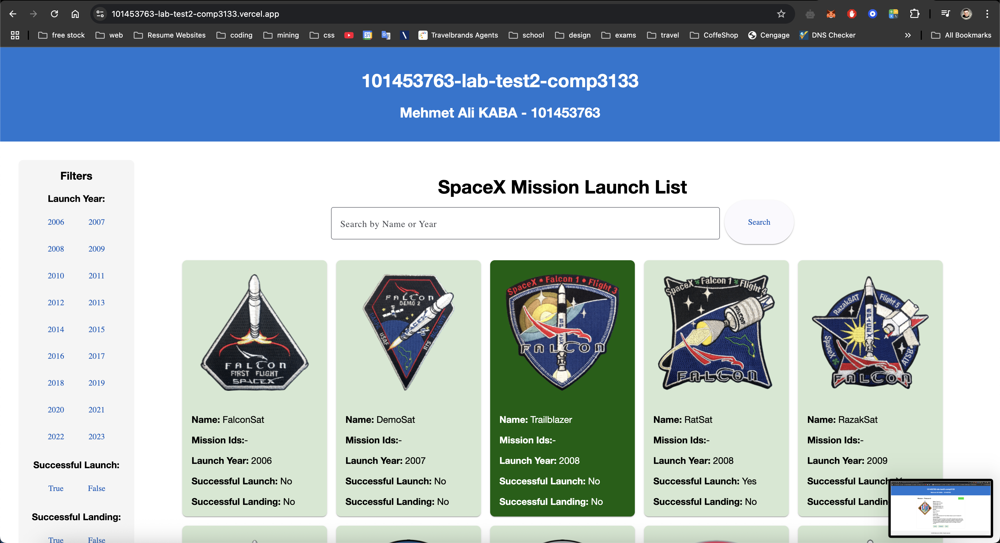
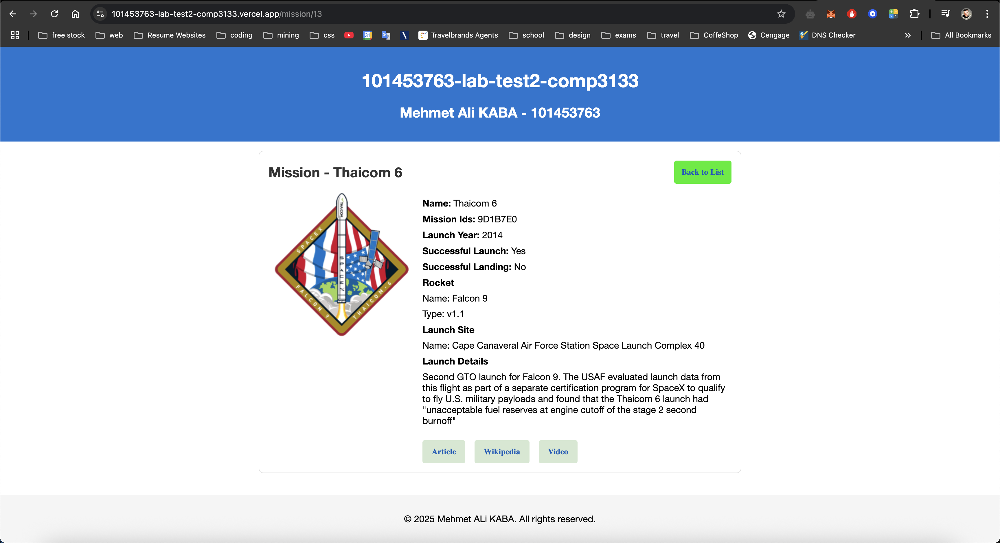
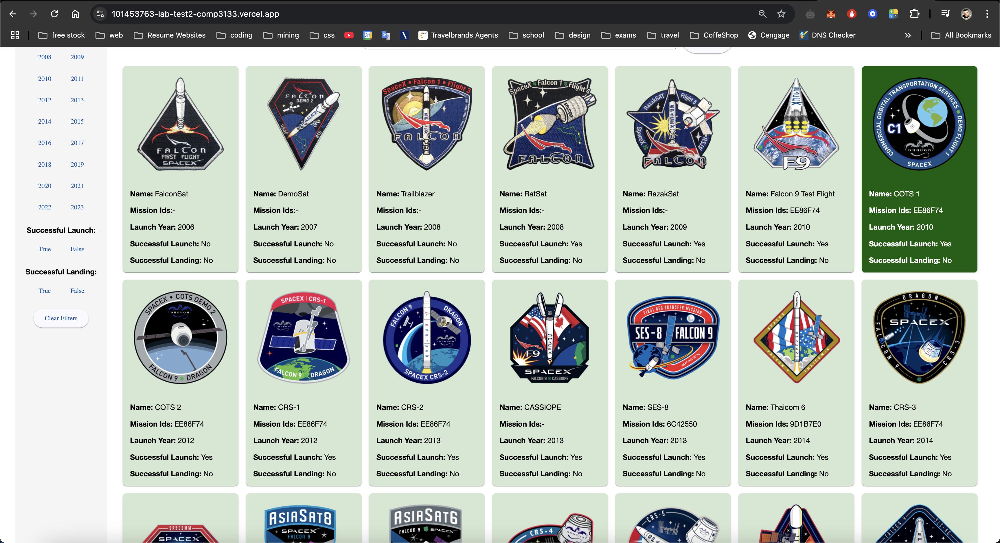

# 🚀 SpaceX Launch Explorer - Angular App

This is a responsive Angular web application that interacts with the SpaceX public API. It displays a list of past launches, offers filtering by launch year, success status, and landing success, and allows users to view detailed information about each mission.

## 🌐 Live Demo

[Deployment on Vercel](https://101453763-lab-test2-comp3133.vercel.app/).

---

## 📁 Project Structure

```
LABTEST-SPACEX-API-APPLICATION/
├── src/
│   ├── app/
│   │   ├── missionlist/
│   │   ├── missiondetails/
│   │   ├── models/
│   │   ├── network/
│   │   ├── app.routes.ts
│   │   └── app.component.*
│   ├── assets/
│   └── environments/
├── angular.json
├── package.json
└── README.md
```

---

## 🧠 Features

- ✅ List of all SpaceX launches
- ✅ Filter by:
  - Launch Year
  - Successful Launch
  - Successful Landing
- ✅ Search bar for mission name or year
- ✅ Clickable cards for mission details
- ✅ Clean UI with Angular Material
- ✅ Responsive and mobile-friendly layout

---

## 🧪 Tech Stack

- Angular 16+
- TypeScript
- Angular Material
- SpaceX REST API
- HTML5 / CSS3 (Flexbox, Grid)

---

## 📸 Screenshots

### Launch List
- Filter panel on the left
- Search bar and responsive cards

### Launch Details
- Launch patch, mission ID, rocket info, launch site, details
- External links to Article, Wikipedia, Video

---

## 🛠 How to Run Locally

```bash
# Clone the repo
git clone https://github.com/kabamehmetali/101453763-lab-test2-comp3133.git
cd spacex-angular-app

# Install dependencies
npm install

# Run the app
ng serve
```

Then navigate to `http://localhost:4200/` in your browser.

---

## 🧾 API Used

[SpaceX REST API v3](https://github.com/r-spacex/SpaceX-API)

Endpoints:
- All Launches: `https://api.spacexdata.com/v3/launches`
- Filter by Year: `https://api.spacexdata.com/v3/launches?launch_year=2020`
- Query Parameters: `launch_success=true`, `land_success=true`

---

## 📦 Folder Highlights

### `/missionlist`
- Displays all missions with filters and search.
- Uses Angular Material `mat-card` components.
- Clickable cards for navigation to details.

### `/missiondetails`
- Shows details of the selected launch.
- Includes mission ID, year, success status, rocket info.

### `/models/mission.ts`
- TypeScript interface for typed API response.

### `/network/spacexapi.service.ts`
- Handles all API communication with SpaceX API.

---

## 📚 Learnings

- Angular standalone components
- Routing with route parameters
- Real-time filtering with query strings
- Material design implementation
- Component communication and modularization

---

## 🤝 Contributors

- [Mehmet Ali KABA](https://github.com/kabamehmetali)

---

## 📄 License

© 2025 Mehmet Ali KABA

### Screenshots

**Launch List:**


**Launch Details:**


**Launch items:**
